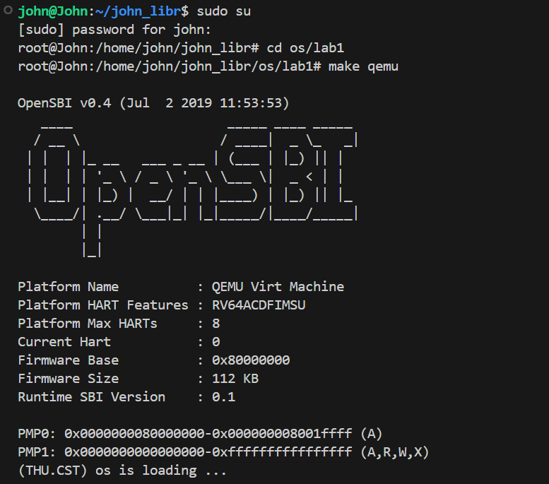
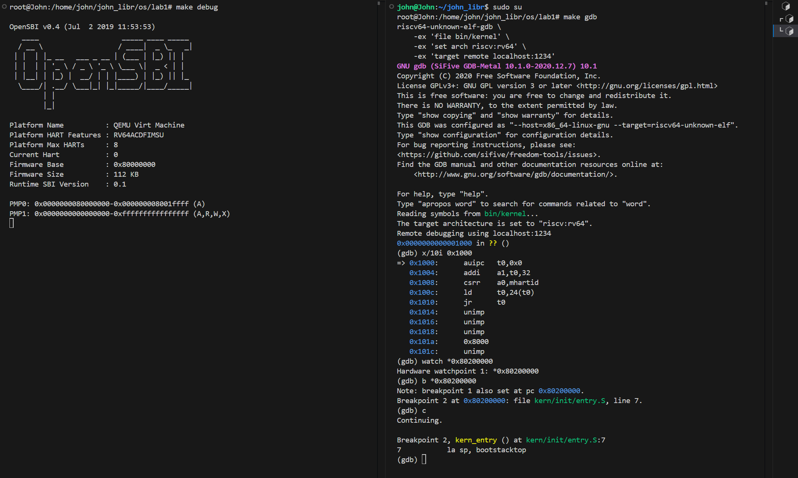

# Step 1


从这段输出可以看出，你的 **内核已经成功被 QEMU + OpenSBI 启动并执行到了自己的加载阶段**。下面我帮你一步步解释这段运行日志里每个部分的含义，以及目前系统所处的位置。

---

## 🧩 一、系统启动流程概览

整个过程可以分为三个阶段：

| 阶段           | 执行者          | 说明                                                      |
| ------------ | ------------ | ------------------------------------------------------- |
| ① **固件阶段**   | OpenSBI      | 相当于 RISC-V 的 BIOS，完成底层硬件初始化、PMP设置等                      |
| ② **引导阶段**   | QEMU+OpenSBI | 将你的内核镜像（通常在物理地址 `0x80200000`）加载到内存                      |
| ③ **内核启动阶段** | 你的 OS（lab1）  | 从 `kern/init/entry.S` 开始执行汇编入口代码，打印 “os is loading ...” |

---

## 🧠 二、逐行解释输出内容

### 🔹 OpenSBI 固件部分

```
OpenSBI v0.4 (Jul  2 2019 11:53:53)
Platform Name          : QEMU Virt Machine
Platform HART Features : RV64ACDFIMSU
Platform Max HARTs     : 8
Current Hart           : 0
Firmware Base          : 0x80000000
Firmware Size          : 112 KB
Runtime SBI Version    : 0.1
```

* 这部分是 OpenSBI 的启动信息。
* 它说明 QEMU 启动了一个 **RISC-V 64 位虚拟机**。
* “HART” 指的是 RISC-V 的“硬件线程”（类似 CPU 核心），你现在是在 **hart 0** 上启动。
* OpenSBI 的任务是初始化最基本的系统环境（如中断、PMP、陷入机制），然后跳转到内核的入口地址执行。

---

### 🔹 PMP 配置

```
PMP0: 0x0000000080000000-0x000000008001ffff (A)
PMP1: 0x0000000000000000-0xffffffffffffffff (A,R,W,X)
```

* PMP = Physical Memory Protection。
* 这里配置了两段内存权限。

  * 第一段（`0x80000000-0x8001ffff`）是 OpenSBI 自己使用的内存区。
  * 第二段是全局可访问区域（A, R, W, X 都允许），给你的 OS 使用。

---

### 🔹 跳转到你的内核

```
(THU.CST) os is loading ...
```

这行是关键！💡

说明：

* OpenSBI 已经执行了 `jr 0x80200000`，跳转到了你编译的 OS 内核入口。
* `0x80200000` 就是你在 `linker.ld` 中定义的 `_start` 或 `kern_entry` 地址。
* 输出 `(THU.CST) os is loading ...` 说明：

  * 你的内核汇编启动代码（`kern/init/entry.S`）成功设置了栈指针；
  * 跳转到了 C 语言入口（通常是 `start_kernel()`）；
  * 并执行了 `printk()` 或类似函数进行屏幕输出。

👉 换句话说：

> 你的内核现在 **已经运行起来了**，已经脱离 OpenSBI 控制，正在执行你自己写的 OS 代码！

---

## 🧩 三、目前运行状态总结

| 模块      | 状态       | 说明                              |
| ------- | -------- | ------------------------------- |
| OpenSBI | ✅ 已完成    | 固件启动完成                          |
| QEMU    | ✅ 正在运行   | 模拟RISC-V虚拟机                     |
| 内核镜像    | ✅ 已加载到内存 | 地址 `0x80200000`                 |
| 内核启动    | ✅ 进行中    | 打印出“os is loading ...”说明进入内核C入口 |

---

## 🔧 四、如果你想进一步调试

你现在有两个常见选择：

### ✅ 方式 1：直接查看 QEMU 运行输出

继续观察 QEMU 输出，看是否还有内核初始化日志或错误（比如页表初始化、异常处理等）。

如果你的程序卡在这行（不动了），可以在代码中添加更多调试输出，比如：

```c
printk("Reached init_memory()\n");
```

---

### ✅ 方式 2：进入调试模式（配合 GDB）

如果你想单步追踪加载过程，可执行：

```bash
make debug   # 启动QEMU等待调试连接
make gdb     # 连接到QEMU进行调试
```

你之前已经做过这一步，停在：

```
Breakpoint 2, kern_entry () at kern/init/entry.S:7
7           la sp, bootstacktop
```

从那里 `si` 单步执行可以看到从汇编到 C 的过渡过程。

---

## 💡 五、小结

这行输出：

```
(THU.CST) os is loading ...
```

代表：

> 你的 RISC-V 内核 **已经成功加载并开始执行**，OpenSBI 和 QEMU 运行正常，链接地址、栈初始化、跳转路径都正确。

下一步你可以：

* 继续观察后续 `printk` 输出，确认内核是否进入主循环；
* 或进入 `make debug + make gdb`，追踪 `start_kernel` 初始化逻辑。

---


# Step 2

## 🧩 一、启动阶段概览

1. **OpenSBI 输出部分**

   ```
   OpenSBI v0.4 (Jul  2 2019 11:53:53)
   Platform Name          : QEMU Virt Machine
   Platform HART Features : RV64ACDFIMSU
   ...
   PMP0: 0x0000000080000000-0x000000008001ffff (A)
   ```

   这表示：

   * QEMU 正在模拟一个 **RISC-V 64 位虚拟机 (virt)**。
   * OpenSBI（类似 BIOS 或固件）已经加载完成。
   * PMP（物理内存保护）区域配置完成。
   * 此时控制权将会交给你的 **内核镜像 kernel**。

---

## 🧰 二、GDB 启动部分

你执行了：

```bash
make gdb
```

等价于：

```bash
riscv64-unknown-elf-gdb \
    -ex 'file bin/kernel' \
    -ex 'set arch riscv:rv64' \
    -ex 'target remote localhost:1234'
```

解释：

* `file bin/kernel`：加载你的内核符号表（调试信息）。
* `set arch riscv:rv64`：设置架构为 64 位 RISC-V。
* `target remote localhost:1234`：连接到 QEMU 提供的调试端口（1234）。

连接后 GDB 就能控制 QEMU 模拟器内部执行。

---

## 🧾 三、查看地址 0x1000 的指令

你执行了：

```gdb
x/10i 0x1000
```

输出：

```
=> 0x1000:      auipc   t0,0x0
   0x1004:      addi    a1,t0,32
   0x1008:      csrr    a0,mhartid
   0x100c:      ld      t0,24(t0)
   0x1010:      jr      t0
```

解释：

* 这里是 **OpenSBI 固件入口处**（物理地址 0x1000）。
* `auipc t0,0x0` + `addi a1,t0,32` 等操作是在设置寄存器。
* `csrr a0,mhartid` 获取当前核 ID。
* `ld t0,24(t0)` 取出下一阶段的入口地址（通常是内核入口地址 0x80200000）。
* `jr t0` 跳转到内核入口执行。

这说明 OpenSBI 已经准备好跳转到你编译的内核。

---

## 🎯 四、设置断点与观察点

你执行了：

```gdb
watch *0x80200000
b *0x80200000
```

* `watch` 是硬件观察点：监控该内存的值变化。
* `b *0x80200000` 是断点：当程序执行到该地址时停下。

GDB 返回：

```
Breakpoint 2 at 0x80200000: file kern/init/entry.S, line 7.
```

表示你的内核入口确实在 `kern/init/entry.S` 第7行，也就是汇编文件中的 `kern_entry` 函数。

---

## 🚀 五、继续运行并命中断点

你执行了：

```gdb
c
```

程序从 OpenSBI 跳到内核入口，GDB 停在：

```
Breakpoint 2, kern_entry () at kern/init/entry.S:7
7           la sp, bootstacktop
```

解释：

* 这行指令 `la sp, bootstacktop` 把栈指针寄存器 `sp`（stack pointer）加载为内核栈顶地址。
* 意味着内核现在刚刚进入启动代码，正在设置栈环境。
* 接下来通常会：

  * 初始化全局寄存器
  * 清空 `.bss` 段
  * 跳转到 `start_kernel`（C 函数入口）

---

## 🧠 六、总结当前状态

| 阶段       | 状态说明                          |
| -------- | ----------------------------- |
| OpenSBI  | 已初始化，准备跳转内核                   |
| QEMU     | 模拟RISC-V虚拟机                   |
| GDB      | 成功附加 QEMU 调试端口                |
| 内核状态     | 停在 `kern_entry` 第一条有效指令（汇编入口） |
| 你可以做的下一步 | 用 `si` 或 `ni` 单步执行，观察寄存器和内存变化 |

---

## 🧩 七、下一步建议

1. 逐条执行启动代码：

   ```gdb
   si   # 单步执行一条汇编指令
   info registers  # 查看寄存器变化
   ```

2. 直到看到跳转到 C 函数入口：

   ```gdb
   b start_kernel
   c
   ```

3. 然后你就能单步调试 C 层代码（`init/main.c` 之类）。

---

