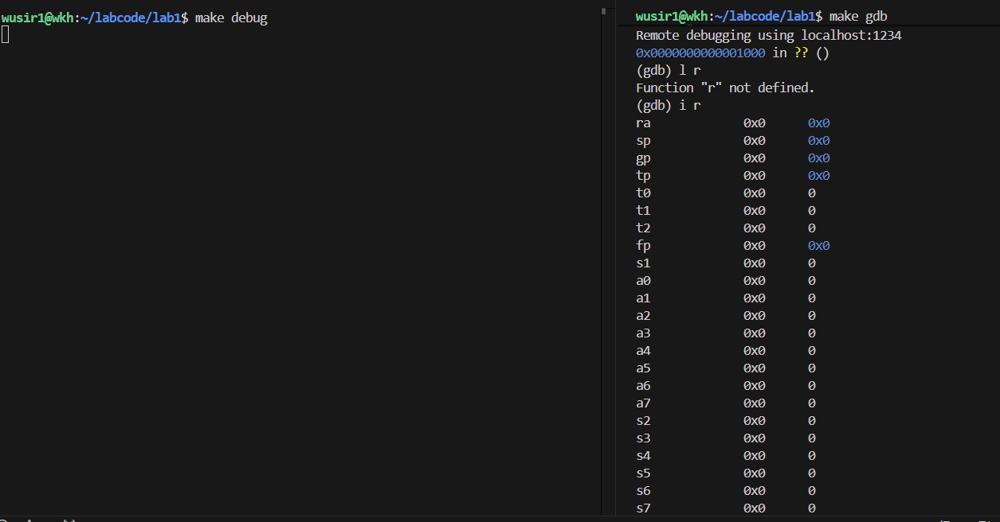
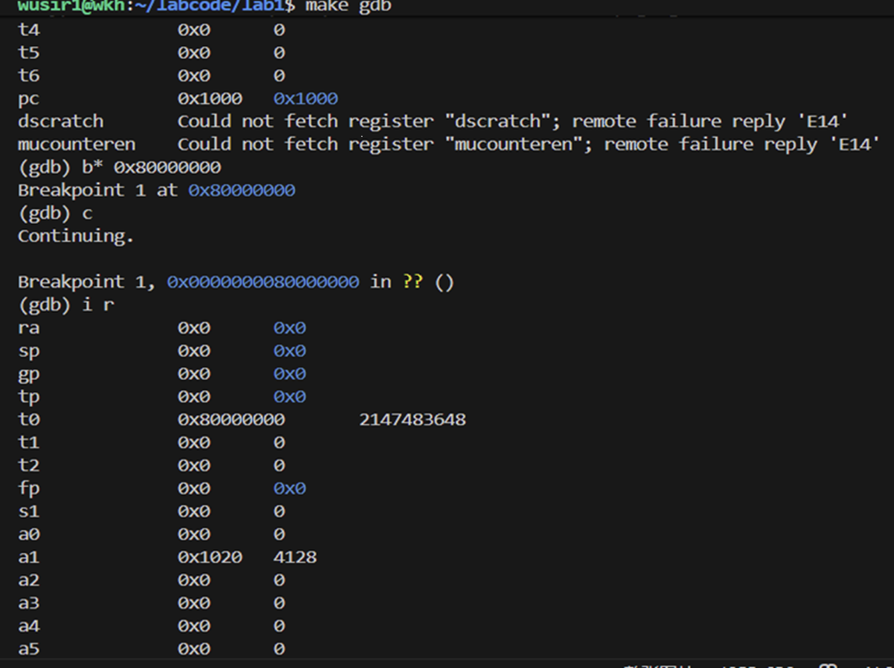
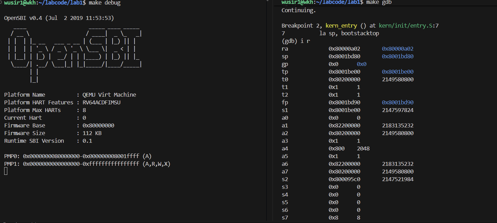
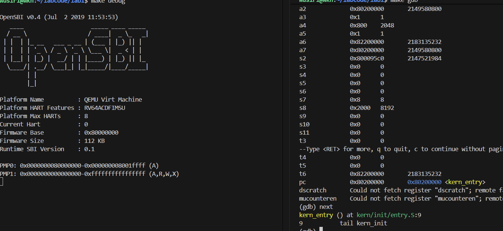
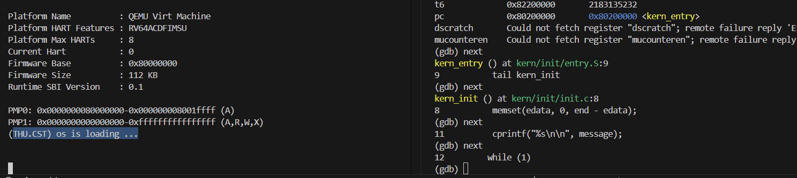

# 练习1：理解内核启动中的程序入口操作
## 总体背景：内核启动流程

在 RISC-V 或类似体系结构中，**内核启动流程（boot process）** 通常如下：

1. **机器上电 → Bootloader（如 OpenSBI）运行**

   * 初始化最基本的硬件（MMU、页表、栈、内存布局）。
   * 把控制权转交给操作系统内核的入口点 `kern_entry`。

2. **进入 `kern_entry` 汇编函数**

   * 建立内核自己的运行栈。
   * 跳转到 C 语言的内核初始化函数 `kern_init`。

3. **在 `kern_init()` 中**

   * 初始化内存管理、异常处理、进程调度、文件系统等。

---

## 逐行分析 `entry.S`

### 源代码回顾

```asm
#include <mmu.h>             # 包含内存管理单元相关常量（如页大小 PGSHIFT）
#include <memlayout.h>       # 包含系统内存布局常量（如内核栈大小 KSTACKSIZE）

    #-----------------------------------------------------------
    # .text 段：可执行代码区
    #-----------------------------------------------------------
    .section .text,"ax",%progbits
    .globl kern_entry         # 声明全局符号，作为内核启动入口
kern_entry:
    #-----------------------------------------------------------
    # 1️⃣ 初始化栈指针（sp）
    #-----------------------------------------------------------
    # la sp, bootstacktop 的含义：
    #   将 bootstacktop 的地址加载到 sp 寄存器。
    #   bootstacktop 是内核栈的最高地址（即栈顶），
    #   栈从高地址向低地址增长。
    #   这一步确保 CPU 进入 C 代码前有合法的栈空间。
    la sp, bootstacktop

    #-----------------------------------------------------------
    # 2️⃣ 跳转到内核 C 语言入口函数 kern_init
    #-----------------------------------------------------------
    # tail kern_init 的作用：
    #   直接跳转到 C 函数 kern_init，
    #   并不返回（tail 等价于 j 指令的尾调用优化形式）。
    #   从此处开始，执行内核初始化的 C 语言逻辑。
    tail kern_init


    #-----------------------------------------------------------
    # .data 段：定义内核栈空间
    #-----------------------------------------------------------
.section .data
    # .align PGSHIFT
    #   按照 2^PGSHIFT (通常为 4096 字节) 对齐，
    #   确保栈在页边界上开始，方便页表映射与管理。
    .align PGSHIFT

    .global bootstack         # 导出符号 bootstack（栈底）
bootstack:
    # .space KSTACKSIZE
    #   预留一段连续空间作为内核启动时使用的栈，
    #   大小为 KSTACKSIZE（一般为 8KB 或 16KB）。
    .space KSTACKSIZE

    .global bootstacktop      # 导出符号 bootstacktop（栈顶）
bootstacktop:
    # bootstacktop 紧跟在 bootstack 之后，
    # 表示栈的最高地址，也就是初始 sp 指向的位置。

    #-----------------------------------------------------------
    # 栈内存布局示意（栈从高向低增长）：
    #
    #   高地址 ↑
    #           +-------------------+ ← bootstacktop (sp 初值)
    #           |                   |
    #           |    栈空间          |
    #           |                   |
    #           +-------------------+ ← bootstack
    #   低地址 ↓
    #-----------------------------------------------------------

````

---

### 指令 1：`la sp, bootstacktop`

### 含义：

`la` 是 “load address” 指令，用来将符号（即变量或标签）的**地址**加载到寄存器。
所以：

```asm
la sp, bootstacktop
```

的作用是：
把标签 `bootstacktop` 的地址加载到 **栈指针寄存器 sp**（stack pointer）中。

### 这行代码完成的操作：

* 将内核启动栈（`bootstack`）的栈顶地址设置为当前栈指针。
* 换句话说，**为内核的第一段执行代码分配了一段可用的栈空间**。

### 背景说明：

在内核刚启动时（从 bootloader 跳进来的时候），CPU 的寄存器 `sp` 可能是未定义的或是 Bootloader 的临时栈。
所以内核第一件事必须是：

> 自己建立一块新的安全的栈空间。

而这块栈空间就是在 `.data` 段定义的：

```asm
bootstack:
    .space KSTACKSIZE        # 分配一段连续空间作为内核栈
bootstacktop:
```

假设：

* `KSTACKSIZE = 8KB`
* 那么 `bootstack` 是底部地址，`bootstacktop` 是栈顶。

由于栈在 RISC-V 是 **向低地址增长** 的，所以我们让 `sp` 指向“栈顶”（高地址）。

### **总结：**

| 指令                    | 操作              | 目的                                  |
| --------------------- | --------------- | ----------------------------------- |
| `la sp, bootstacktop` | 将内核栈顶地址加载到 `sp` | 为内核代码设置运行栈，保证后续函数调用、保存寄存器等操作有安全的栈空间 |

---

### 指令 2：`tail kern_init`

### 含义：

`tail` 是 GNU 汇编器（以及 RISC-V）中对：

```asm
j kern_init
```

或

```asm
jal kern_init
ret
```

的**优化伪指令**。
它的含义是：**无返回的跳转（尾调用）到另一个函数**。

### 这行代码完成的操作：

直接跳转到 C 函数 `kern_init`，并且：

* 不再保留当前 `kern_entry` 的返回地址；
* 不占用额外栈空间（节省指令和栈）。

这意味着：

> 从此刻开始，内核的执行正式进入 `kern_init()` 函数，`kern_entry` 不会再回来。

---

### **总结：**

| 指令               | 操作                    | 目的                          |
| ---------------- | --------------------- | --------------------------- |
| `tail kern_init` | 无返回地跳转到 `kern_init()` | 切换执行流到 C 语言内核初始化函数，开始系统级初始化 |

---

## 整体总结

| 阶段 | 汇编语句                  | 功能                | 目的                |
| -- | --------------------- | ----------------- | ----------------- |
| 1  | `la sp, bootstacktop` | 设置栈指针 `sp` 指向内核栈顶 | 为内核提供安全可用的运行栈     |
| 2  | `tail kern_init`      | 无返回跳转到内核初始化函数     | 开始执行 C 语言的系统初始化逻辑 |

---

## 扩展理解

在操作系统的启动过程中，**汇编部分只负责硬件态到内核 C 环境的“桥梁”工作**：

* 建立栈
* 设置全局寄存器（如 sp、gp）
* 初始化内存映射或页表（若需要）
* 跳转到 `kern_init()` 进入 C 世界

所以这一小段汇编虽然短，却是 **内核从“裸机”到“高层初始化”的关键过渡点**。

# 练习 2：GDB 跟踪 RISC-V 启动流程
目标：跟踪从复位地址 0x1000 开始，直到内核第一条指令（`kern_entry @ 0x80200000`）执行。

## 1 调试准备
```bash
make clean && make          # 生成 bin/kernel ucore.img
make debug                  # QEMU (-gdb tcp::1234 -S) 挂起等待 GDB
make gdb                    # 连接 GDB 会停在 0x1000
```

## 2 跟踪步骤
```gdb
# 启动后 PC=0x1000 (复位向量)
(gdb) x/10i 0x1000           # 观察固件早期指令（OpenSBI）
(gdb) watch *0x80200000      # 观察内核镜像写入瞬间
(gdb) b *0x80200000          # 在内核入口物理地址断点
(gdb) c                      # 继续执行，直到固件完成加载并跳转
```





## 3 观察结果摘要
| 阶段 | 观察到的地址/现象 | 说明 |
|------|------------------|------|
| 复位 | PC=0x0000000000001000 | QEMU virt 复位向量；执行固件 ROM/OpenSBI 指令 |
| 固件初始化 | 多条访问/设置 CSR/内存的指令 | 建立最小执行环境，准备加载内核 |
| 内核加载 | `watch *0x80200000` 触发  | 固件将 `ucore.img` 拷贝到 DRAM 基址 + 偏移 |
| 跳转内核 | 断点命中 0x80200000 | 开始执行 `kern_entry` 第一条指令 `la sp, bootstacktop` |
| 进入 C | 单步执行 `tail kern_init` 后 PC 到 `kern_init` | 进入 C 初始化逻辑，清 BSS，打印信息 |
| 死循环 | 停在 `while(1)` | 等待后续实验扩展 |

## 4 回答问题
1) RISC-V 硬件加电后最初执行的几条指令位于地址：`0x1000`（QEMU virt 的默认复位向量）。
2) 这些早期指令（固件/OpenSBI）主要功能：设置特权级初始状态、建立必要的机器态环境、解析/准备内核镜像（或在本实验场景由 QEMU loader 直接放置）、最终跳转到内核入口地址 0x80200000。
3) 验证方法：在 GDB 中观察 PC 初值；设置 `b *0x80200000`；可用 `watch *0x80200000` 捕获写入；断点命中后查看反汇编与符号匹配。

## 5 OS 原理中重要但实验未涉及的知识点​
1) 进程管理：实验仅聚焦 “从硬件到内核启动” 的初始化阶段，未涉及 OS 核心的进程管理功能，如进程控制块（PCB）的创建与维护、进程调度算法（如时间片轮转、优先级调度）、进程切换时的上下文保存与恢复等，而这些是操作系统实现 “并发执行” 的关键机制。​
2) 内存管理：实验中仅涉及 “内核加载到固定地址（0x80200000）” 的物理内存操作，未覆盖 OS 原理中内存管理的核心内容，包括虚拟内存地址空间的划分、分页 / 分段机制的实现、页表管理、内存分配算法等，这些机制是操作系统实现 “内存抽象与高效利用” 的核心。​
3) 文件系统：启动阶段无需访问持久化存储设备，因此实验未涉及文件系统相关功能。但 OS 原理中，文件系统是 “管理存储设备、提供文件访问接口” 的关键模块，包括文件目录结构、文件控制块（FCB）、文件读写机制、不同文件系统（如 ext4、FAT32）的实现差异等，这些是操作系统与用户数据交互的核心载体。​
4) 中断与异常处理：实验仅提到 OpenSBI 初始化中断向量表，未深入 OS 原理中中断与异常处理的完整流程。例如，中断的分级（如外部中断、内部异常）、中断响应时的栈切换、系统调用（如通过 ecall 指令触发的异常）的处理流程、中断屏蔽与优先级管理等，这些机制是操作系统 “响应外部事件、实现内核与用户态通信” 的核心。​
5) 设备管理：实验未涉及 OS 原理中的设备管理模块，包括设备驱动程序的设计、设备分配算法（如静态分配、动态分配）、I/O 控制方式（如程序查询、中断驱动、DMA）等。这些功能是操作系统 “管理硬件设备、协调设备资源使用” 的关键，也是内核与硬件交互的核心延伸。


# 实验知识点梳理

## 一、实验与操作系统原理对应关系

| 实验知识点                                | 操作系统原理知识点                              | 说明与理解                                                                                                                                    |
| ------------------------------------ | -------------------------------------- | ---------------------------------------------------------------------------------------------------------------------------------------- |
| **1️⃣ 内核启动入口 (`kern_entry`)**        | **操作系统的引导与加载**                         | 在 OS 原理中，系统引导包括：上电 → Bootloader → OS 内核加载。本实验对应的是 RISC-V 的 `entry.S` 启动过程，是从硬件环境到内核环境的“第一跳”。`kern_entry` 就是 OS 的执行入口，相当于从“裸机”进入“内核态”的桥梁。 |
| **2️⃣ 栈初始化 (`la sp, bootstacktop`)** | **函数调用与栈机制**                           | 内核启动前 CPU 无法使用 C 函数调用，因为栈未建立。通过在汇编里设置 `sp`，我们手动构造一个“运行栈帧”的基础环境，使后续 C 函数调用成为可能。这体现了“从硬件到语言运行环境”的衔接。                                       |
| **3️⃣ 跳转 C 初始化 (`tail kern_init`)**  | **上下文切换与控制转移**                         | `tail` 指令实现“无返回跳转”，本质是程序控制流的一次切换。对应 OS 原理中“上下文切换”的简化版：寄存器状态和栈都重新建立，开始执行更高层逻辑。                                                            |
| **4️⃣ Bootloader 与 OpenSBI 角色**      | **引导加载程序（Bootloader）与特权级管理（S/M/U 模式）** | Bootloader（OpenSBI）相当于机器模式的“运行时环境”，负责初始化 CSR、建立页表、设置特权级，再切换到 S 模式执行内核。实验中 OpenSBI 就是实际完成 `0x1000 → 0x80200000` 跳转的执行体。                   |
| **5️⃣ 地址空间与内存布局 (`memlayout.h`)**    | **虚拟内存管理与内核空间划分**                      | 文件中定义了 `KSTACKSIZE`、`KERNBASE` 等常量，对应 OS 原理中的“内核虚拟地址空间布局”。实验阶段虽然未开启 MMU，但预先为分页机制设计了地址框架。                                                 |
| **6️⃣ GDB 调试启动流程**                   | **可观察性与系统状态监测**                        | 使用 GDB 单步跟踪启动，是理解“机器态 → 内核态”转移最直观的方式。它对应操作系统设计中的“调试接口”和“系统状态可观测性”概念。                                                                     |
| **7️⃣ 固件加载镜像 (`watch *0x80200000`)** | **操作系统加载与内存拷贝机制**                      | 观察 OpenSBI 将内核镜像写入物理内存，这与 OS 原理中的“程序加载”一致：把可执行文件从外存加载到内存特定区域等待执行。                                                                        |
| **8️⃣ 汇编与 C 的边界**                    | **用户级编程环境与系统级环境的转换**                   | 从汇编 `entry.S` 进入 `kern_init()`，意味着从裸机硬件到 C 环境的“语言边界跨越”，这是操作系统底层必须理解的关键过程。                                                                |
| **9️⃣ 物理地址到符号映射**                    | **链接与地址重定位原理**                         | 在实验中，通过符号 `bootstack`、`bootstacktop` 映射到具体地址，对应操作系统加载阶段的“重定位与符号解析”。                                                                      |
| **🔟 初始化后的执行状态（`while(1)`）**         | **内核主循环与空闲态**                          | 内核完成初始化后进入死循环等待事件，体现了操作系统“常驻内存、持续运行”的特性，是后续调度、异常处理的基础。                                                                                   |

---

## 二、综合理解

在本实验中，完成了从 **硬件复位 → OpenSBI 启动 → 内核接管 → 进入 C 初始化函数** 的完整过程。
这对应操作系统原理课程中 **“系统引导与启动（Boot & Init）”** 的核心内容。

> **抽象理解：**
>
> * Bootloader → “加载与引导”阶段
> * `entry.S` → “硬件态到内核态过渡”
> * `kern_init()` → “系统服务初始化”

> **具体层面：**
>
> * 汇编代码实现底层寄存器、栈设置；
> * C 代码开始高层模块初始化；
> * 二者通过“栈与跳转”实现平滑衔接。

---

## 三、思考与延伸

1. **为什么栈必须在页边界对齐？**
   页表机制要求内存映射按页粒度进行，页对齐能保证内核栈独立映射与安全性。

2. **如果 `sp` 设置错误会怎样？**
   进入 `kern_init()` 后会崩溃（例如在保存寄存器或函数调用时），因为栈地址非法。

3. **为什么使用 `tail` 而不是 `jal`？**
   `tail` 不保存返回地址，不会生成多余栈帧，符合“启动入口不返回”的语义，且节省指令与栈空间。

---

## 四、知识点总结图（思维导图式）

```
硬件上电(0x1000)
   ↓
OpenSBI 初始化
   ↓
加载内核镜像 → 0x80200000
   ↓
执行 entry.S
   ├─ 设置栈顶: la sp, bootstacktop
   └─ 跳转C入口: tail kern_init
         ↓
     执行 C 代码初始化
         ↓
     内核主循环 (while(1))
```

---
