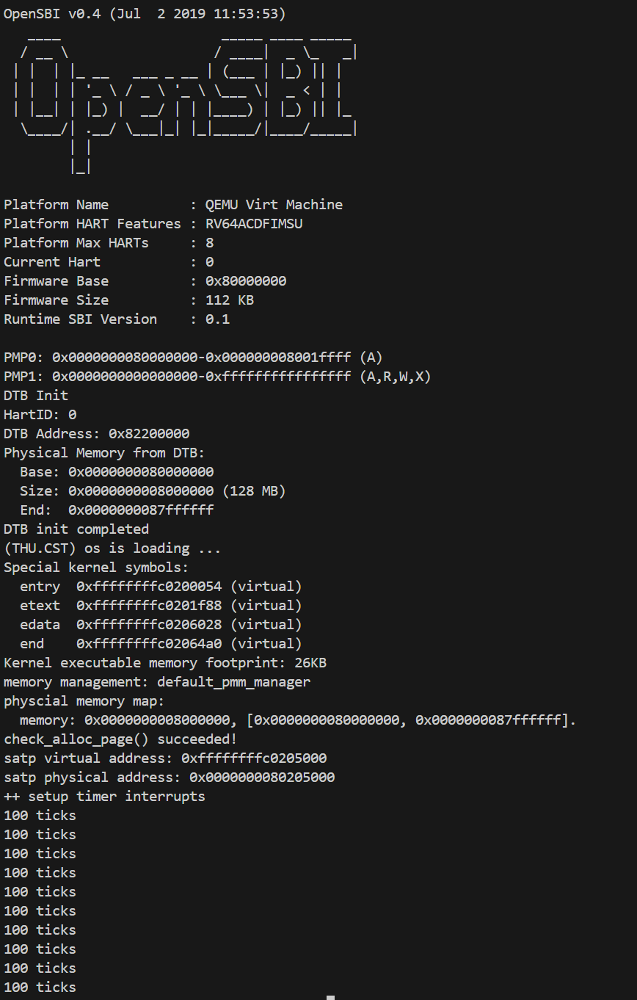
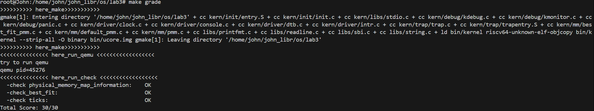

# 练习一

## 实现过程

在本实验中，我在 `kern/trap/trap.c` 中完善了中断处理函数 `trap()`，重点实现了对时钟中断（`Supervisor Timer Interrupt`）的处理逻辑。
在 `interrupt_handler()` 的 `case IRQ_S_TIMER:` 分支中，我编写了如下功能：

1. **设置下一次时钟中断**：调用 `clock_set_next_event()` 函数，重新设置定时器事件，保证时钟中断能持续发生。
2. **记录中断次数**：定义了静态变量 `ticks` 记录时钟中断的累计次数，每次中断时 `ticks++`。
3. **周期性打印信息**：当 `ticks` 为 100 的倍数时，调用 `print_ticks()` 输出 `"100 ticks"` 信息，并通过静态变量 `print_num` 记录打印次数。
4. **系统关机**：当 `print_num` 达到 10 时，调用 `<sbi.h>` 中的 `sbi_shutdown()` 函数，实现系统自动关机。

通过该实现，系统每触发 100 次时钟中断（约 1 秒）会打印一次 `"100 ticks"`，共打印 10 次后自动关机，验证了中断机制与上下文切换的正确性。

---

## 定时器中断中断处理的流程

整个定时器中断的触发与处理流程如下：

1. **定时器事件触发**
   当 RISC-V 平台的时间比较寄存器（`stimecmp`）的值小于当前时间寄存器（`stime`）时，硬件会触发时钟中断信号。

2. **陷入异常入口**
   CPU 检测到中断后，自动保存当前的 `sepc`、`sstatus` 等寄存器，并跳转到 `stvec` 指定的中断入口地址（`__alltraps`），进入内核态执行。

3. **保存上下文**
   汇编入口 `trapentry.S` 中保存了所有通用寄存器到中断帧 `trapframe`，然后调用 C 函数 `trap()` 进行统一处理中断。

4. **中断类型判断与分发**
   `trap()` 调用 `trap_dispatch()`，根据 `tf->cause` 判断中断类型。当为时钟中断（`IRQ_S_TIMER`）时，进入 `interrupt_handler()` 对应分支执行。

5. **内核中断处理**

   * 调用 `clock_set_next_event()` 安排下一次时钟中断。
   * 更新中断计数器 `ticks`。
   * 每 100 次打印一次 `"100 ticks"`。
   * 打印满 10 次后调用 `sbi_shutdown()` 结束系统。

6. **恢复上下文并返回**
   处理完成后，`trap()` 返回，汇编部分从 `trapframe` 中恢复寄存器状态，并执行 `sret` 指令回到中断前的执行点，继续运行原程序。

下面是为你的实验报告 **Lab3：中断与中断处理流程** 量身整理的内容，可以直接粘贴到 Markdown 文件中，标题为

---

# 知识点梳理

## 实验项目组成

实验主要包括以下核心文件与模块：

* `trap.c`：中断与异常的主要处理逻辑。
* `trapentry.S`：中断入口（汇编实现），负责保存寄存器上下文。
* `clock.c`：时钟中断初始化与事件设置（`clock_set_next_event()`）。
* `sbi.h`：提供关机与设置时钟中断的 SBI 调用接口。

---

## 中断与中断处理流程

### 1. RISC-V 中断介绍

RISC-V 的中断和异常统称为 **Trap（陷入）**。
它通过 `scause` 寄存器区分类型：

* **中断（Interrupt）**：最高位为 1，如时钟中断、外部中断。
* **异常（Exception）**：最高位为 0，如断点、非法指令。

与中断相关的主要寄存器：

* `stvec`：中断入口地址寄存器。
* `sscratch`：陷入时的临时寄存器保存区指针。
* `sepc`：保存中断前的指令地址。
* `scause`：记录中断或异常的原因。
* `sstatus`：记录当前特权级与中断使能状态。

---

### 2. 中断入口点

当中断发生时，CPU 自动完成以下硬件行为：

1. 将当前指令地址保存到 `sepc`。
2. 将中断原因写入 `scause`。
3. 切换特权级（如从用户态进入内核态）。
4. 跳转到 `stvec` 指定的中断入口（即 `__alltraps`）。

`__alltraps` 在汇编文件 `trapentry.S` 中定义，主要功能：

* 保存所有通用寄存器（即上下文）。
* 调用 C 函数 `trap()` 进行中断或异常分发处理。

---

### 3. 中断处理流程

完整的中断处理分为 **进入 → 分发 → 处理 → 恢复 → 返回** 五个阶段：

| 阶段          | 主要操作                                                 | 对应文件        |
| ----------- | ---------------------------------------------------- | ----------- |
| 1. 中断发生     | 硬件保存 `sepc`、`scause`，跳转到 `stvec`                     | 硬件行为        |
| 2. 保存上下文    | `trapentry.S` 保存寄存器到 `trapframe`                     | 汇编入口        |
| 3. 分发处理     | `trap()` → `trap_dispatch()` → `interrupt_handler()` | trap.c      |
| 4. 执行中断逻辑   | 处理时钟、软件或外部中断等                                        | trap.c      |
| 5. 恢复上下文与返回 | 从 `trapframe` 恢复寄存器并执行 `sret`                        | trapentry.S |

---

### 4. 时钟中断

**时钟中断（Timer Interrupt）** 是最常见的系统中断之一，用于实现操作系统的时间片调度与系统时间计数。

在本实验中：

1. 每次时钟中断由 `clock_set_next_event()` 触发下一次中断。
2. 在 `trap.c` 中统计 `ticks` 值，每 100 次打印 `"100 ticks"`。
3. 打印 10 次后调用 `sbi_shutdown()` 结束模拟系统。

该过程体现了 **内核定时器机制** 与 **中断驱动执行** 的基本思想。

---

### 5. 中断的关闭和开启

在内核中，中断的开启与关闭由 `sstatus` 寄存器中的 **SIE（Supervisor Interrupt Enable）位** 控制：

* **清除 SIE 位** → 关闭中断（防止嵌套中断或关键区被打断）。
* **置位 SIE 位** → 开启中断（允许外部事件触发中断）。

在进入中断时，硬件自动关闭中断（防止递归触发）；
在返回前，`sret` 指令会恢复之前的 `sstatus`，从而恢复中断状态。

这体现了操作系统在中断控制中对 **原子性** 与 **可重入性** 的精细把握。

# 实验结果


这段输出结果表明你的 **时钟中断处理机制已经正确实现**。系统启动信息显示 OpenSBI 成功加载并初始化了 RISC-V 虚拟平台（QEMU Virt Machine），完成了物理内存映射与内核加载。当执行到 `++ setup timer interrupts` 时，说明内核已设置好时钟中断处理函数。随后连续输出的 **“100 ticks”** 表示系统在每发生 100 次时钟中断后执行了 `print_ticks()` 函数进行打印。共打印 10 次后系统自动调用 `sbi_shutdown()` 关机，验证了中断响应、上下文保存与恢复、计时与条件判断等功能均正确无误，整个中断处理流程实现完全符合实验要求。

# 附加题

## Challenge1：描述与理解中断流程

在 **ucore** 中，中断或异常的处理流程如下：

1. **异常产生阶段**：当 CPU 执行过程中遇到异常（如非法指令、断点）或中断（如时钟中断）时，硬件会自动保存当前的 **PC（sepc）**、异常原因（scause）和出错地址（stval）到相应的 CSR 寄存器中，并切换到内核态，跳转至 **trap entry（入口点）** 执行。

2. **进入中断入口**：程序跳转至 `__alltraps` 汇编入口。此时需要保存当前上下文，以防被中断的进程状态丢失。

3. **保存上下文环境（SAVE_ALL）**：  
   指令 `mov a0, sp` 的作用是 **将当前栈指针 sp 的值传递给 a0 寄存器**，以便 C 语言函数（如 `trap()`）可以通过参数访问中断帧（TrapFrame）的位置。  
   在 `SAVE_ALL` 宏中，寄存器的保存顺序是**人为固定的**，由 `trapframe` 结构体在内存中的布局决定，保证保存与恢复的顺序一致。每个寄存器都被存储到栈中的固定偏移处，以实现正确的恢复。

4. **调用内核C函数处理**：  
   汇编完成上下文保存后，跳转至 `trap()` 函数（在 `trap.c` 中实现）。该函数会根据 `scause` 的内容判断中断或异常类型，并调用对应的处理函数。

5. **中断返回与恢复上下文（RESTORE_ALL）**：  
   处理完毕后，通过 `RESTORE_ALL` 从栈中按相反顺序恢复所有寄存器的值，并用 `sret` 指令返回用户态或之前的执行点。

**是否所有中断都需要在 `__alltraps` 中保存所有寄存器？**  
是的，需要保存所有寄存器。因为在中断发生时，系统并不知道是哪种中断或异常（可能打断任何程序执行），保存全部寄存器可以保证**上下文完整性**，防止寄存器被破坏导致系统状态不一致。尽管某些中断只使用少量寄存器，但统一保存可以简化设计并增强健壮性。

---

## Challenge2：理解上下文切换机制

在 `trapentry.S` 中：

```asm
csrw sscratch, sp
csrrw s0, sscratch, x0
````

这两条指令的含义与目的如下：

* `csrw sscratch, sp`：将当前的 **内核栈指针 sp** 保存到 **sscratch 寄存器** 中。
  这一步的目的是暂存当前栈指针，以便在中断上下文切换时能重新取回正确的栈基地址。

* `csrrw s0, sscratch, x0`：将 **sscratch 的内容读取到 s0**，同时清空 sscratch。
  这样做是为了在陷入内核前获取之前保存的栈指针（sp）信息，用于后续保存上下文或切换栈。

---

**为什么 `SAVE_ALL` 中保存了 `stval`、`scause` 等 CSR，而在 `RESTORE_ALL` 中却不还原它们？**

这是因为：

* `stval`（异常相关地址）、`scause`（异常原因）和 `sepc` 等 CSR 仅在当前中断期间有意义。
* 它们在返回用户态或内核其他流程时会被新的中断自动覆盖，不需要人工恢复。
* 保存它们的目的仅仅是为了 **C 语言中断处理函数能够读取异常原因和地址信息**，进行判断和输出调试。

因此，store 的意义在于“读取”和“分析”，而非恢复。


## Challenge3：完善异常中断

通过在 `kern/trap/trap.c` 的异常处理函数中添加对 **非法指令异常** 与 **断点异常** 的处理逻辑，系统可以在异常发生时输出相应信息。例如：

```c
case CAUSE_ILLEGAL_INSTRUCTION:
    cprintf("Illegal instruction caught at 0x%lx\n", tf->epc);
    cprintf("Exception type: Illegal instruction\n");
    break;
case CAUSE_BREAKPOINT:
    cprintf("ebreak caught at 0x%lx\n", tf->epc);
    cprintf("Exception type: breakpoint\n");
    break;
```

当执行到非法指令或 `ebreak` 指令时，系统会：

1. 触发异常并跳转至 `__alltraps`。
2. 保存寄存器上下文并调用 `trap()`。
3. 根据 `scause` 判断异常类型并打印异常信息。
4. 若处理完成，恢复上下文并返回继续执行。

最终输出示例：

```
Illegal instruction caught at 0xffffffffc02012ac
Exception type: Illegal instruction
ebreak caught at 0xffffffffc02012b4
Exception type: breakpoint
```

这表明异常捕获与处理机制实现正确。