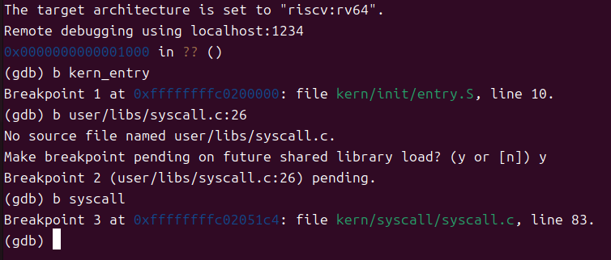
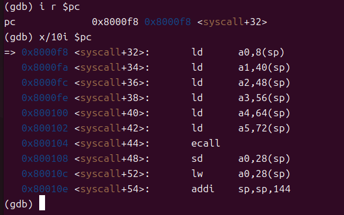
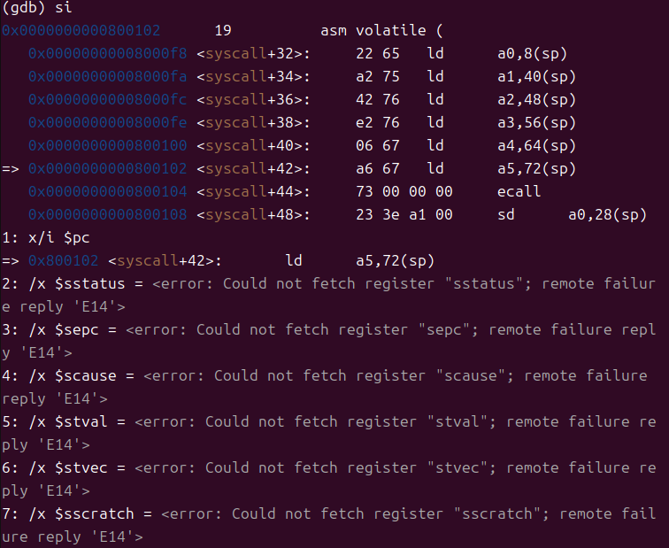
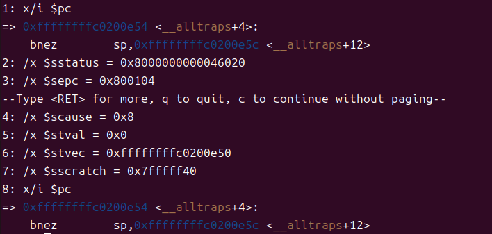
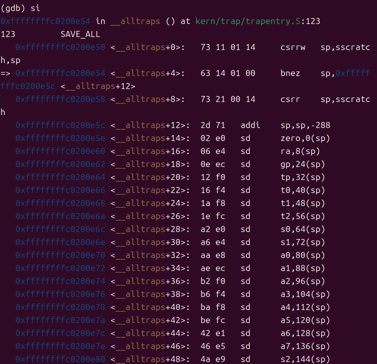
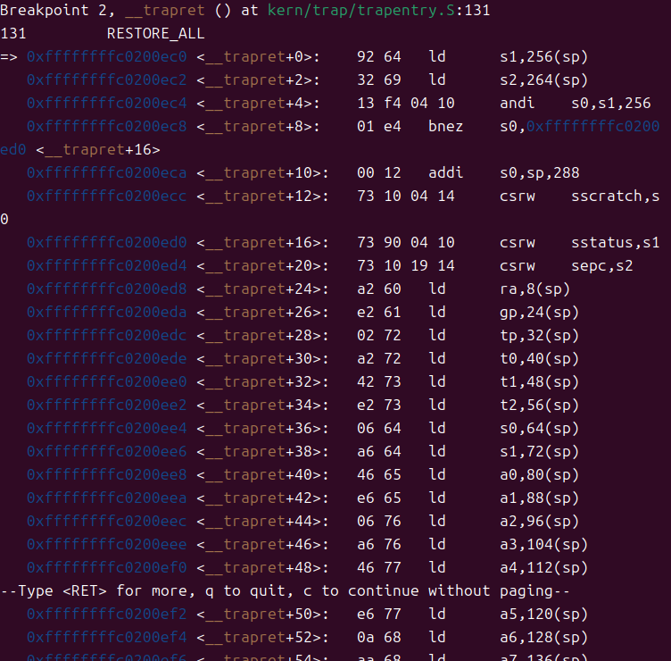
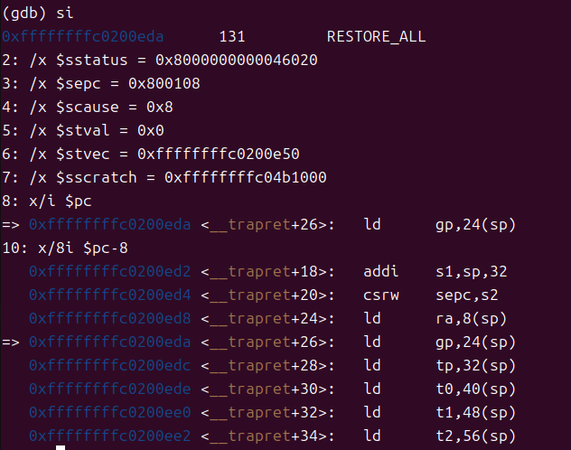

# Lab5 实验报告

## 练习1: 加载应用程序并执行

### 设计实现过程

在 `load_icode` 函数的第6步中，需要设置 `trapframe` 的内容，使得进程能够正确地从内核态切换到用户态并开始执行。具体实现如下：

```c
//(6) setup trapframe for user environment
struct trapframe *tf = current->tf;
// Keep sstatus
uintptr_t sstatus = tf->status;
memset(tf, 0, sizeof(struct trapframe));

tf->gpr.sp = USTACKTOP;           // 设置用户栈顶指针
tf->epc = elf->e_entry;           // 设置程序入口地址
tf->status = (read_csr(sstatus) & ~SSTATUS_SPP) | SSTATUS_SPIE;
```

**关键要点：**

1. **设置用户栈指针 (`tf->gpr.sp`)**：设置为 `USTACKTOP`，这是用户栈的栈顶地址，确保用户程序有正确的栈空间。

2. **设置程序入口地址 (`tf->epc`)**：设置为 ELF 文件头中的 `e_entry` 字段，这是用户程序的入口地址。当从内核态返回用户态时，`sret` 指令会跳转到 `sepc` 寄存器指向的地址（即 `tf->epc`）。

3. **设置状态寄存器 (`tf->status`)**：
   - 清除 `SSTATUS_SPP` 位：表示异常来自用户态，这样 `sret` 指令会返回到用户态（S-mode → U-mode）
   - 设置 `SSTATUS_SPIE` 位：使能中断，确保返回用户态后可以响应中断

### 用户态进程执行的完整过程

从进程被选中执行到执行应用程序第一条指令的完整流程：

1. **调度选择进程**：调度器通过 `schedule()` 函数选择一个 RUNNABLE 状态的进程，调用 `proc_run()` 切换到该进程

2. **上下文切换**：
   - `proc_run()` 调用 `switch_to()` 完成上下文切换
   - 切换页表（`lsatp`）和内核栈
   - 恢复进程的内核上下文（寄存器）

3. **中断返回准备**：
   - 执行到 `forkret()` 或 `kernel_thread_entry()`
   - 最终调用 `__trapret` 准备从内核态返回

4. **恢复 trapframe**：
   - `__trapret` 从进程的 `trapframe` 中恢复所有通用寄存器
   - 恢复 `sepc`（即 `tf->epc`，指向用户程序入口）
   - 恢复 `sstatus`（即 `tf->status`）

5. **返回用户态**：
   - 执行 `sret` 指令
   - CPU 切换到用户态（U-mode）
   - PC 跳转到 `sepc` 指向的地址（用户程序入口）
   - 开始执行用户程序的第一条指令

---

## 练习2: 父进程复制自己的内存空间给子进程

### 设计实现过程

在 `copy_range` 函数中实现内存页的复制，主要步骤如下：

```c
if (*ptep & PTE_V) {
    if ((nptep = get_pte(to, start, 1)) == NULL) {
        return -E_NO_MEM;
    }
    uint32_t perm = (*ptep & PTE_USER);
    struct Page *page = pte2page(*ptep);
    assert(page != NULL);
    
    // 分配新页面
    struct Page *npage = alloc_page();
    assert(npage != NULL);
    
    // 获取源页面和目标页面的内核虚拟地址
    void *src_kvaddr = page2kva(page);
    void *dst_kvaddr = page2kva(npage);
    
    // 复制页面内容
    memcpy(dst_kvaddr, src_kvaddr, PGSIZE);
    
    // 建立目标页表映射
    int ret = page_insert(to, npage, start, perm);
    assert(ret == 0);
}
```

**实现要点：**

1. **分配新物理页**：调用 `alloc_page()` 为子进程分配新的物理页
2. **获取内核虚拟地址**：通过 `page2kva()` 获取源页面和目标页面的内核虚拟地址
3. **复制内存内容**：使用 `memcpy()` 将父进程页面的内容复制到子进程的新页面
4. **建立页表映射**：调用 `page_insert()` 在子进程的页表中建立虚拟地址到新物理页的映射

### Copy on Write (COW) 机制设计

#### 概要设计

Copy on Write 是一种延迟复制优化技术，核心思想是：
- fork 时不立即复制内存，而是让父子进程共享同一物理页面
- 将共享页面标记为只读
- 当任一进程尝试写入时，触发页面错误
- 此时才真正复制页面，并修改权限为可写

#### 详细设计

**1. 数据结构修改**

```c
// 在 Page 结构中添加引用计数
struct Page {
    int ref;                    // 页面引用计数
    // ... 其他字段
};
```

**2. fork 时的处理（修改 copy_range）**

```c
int copy_range(pde_t *to, pde_t *from, uintptr_t start, uintptr_t end, bool share) {
    // ...
    if (*ptep & PTE_V) {
        struct Page *page = pte2page(*ptep);
        
        if (share) {  // COW 模式
            // 增加页面引用计数
            page_ref_inc(page);
            
            // 将父进程页面设为只读
            *ptep &= ~PTE_W;
            
            // 子进程也映射到同一物理页，也设为只读
            uint32_t perm = (*ptep & PTE_USER) & ~PTE_W;
            page_insert(to, page, start, perm);
            
            // 刷新 TLB
            tlb_invalidate(from, start);
        } else {
            // 原有的立即复制逻辑
            // ...
        }
    }
}
```

**3. 写时触发页面错误处理**

```c
// 在 do_pgfault 中处理 COW
int do_pgfault(struct mm_struct *mm, uint_t error_code, uintptr_t addr) {
    // 检查是否是写保护错误
    if (error_code & 0x2) {  // 写操作导致的页错误
        pte_t *ptep = get_pte(mm->pgdir, addr, 0);
        if (ptep && (*ptep & PTE_V)) {
            struct Page *page = pte2page(*ptep);
            
            // 检查是否是 COW 页面
            if (page_ref(page) > 1) {
                // 多个进程共享，需要复制
                struct Page *npage = alloc_page();
                if (npage == NULL) {
                    return -E_NO_MEM;
                }
                
                // 复制页面内容
                memcpy(page2kva(npage), page2kva(page), PGSIZE);
                
                // 减少原页面引用计数
                page_ref_dec(page);
                
                // 更新页表映射，恢复写权限
                uint32_t perm = (*ptep & PTE_USER) | PTE_W;
                page_insert(mm->pgdir, npage, ROUNDDOWN(addr, PGSIZE), perm);
                
                return 0;
            } else if (page_ref(page) == 1) {
                // 只有一个进程引用，直接恢复写权限
                *ptep |= PTE_W;
                tlb_invalidate(mm->pgdir, ROUNDDOWN(addr, PGSIZE));
                return 0;
            }
        }
    }
    
    // 其他页错误处理...
}
```

**4. 页面释放处理**

```c
void page_remove(pde_t *pgdir, uintptr_t la) {
    pte_t *ptep = get_pte(pgdir, la, 0);
    if (ptep != NULL && (*ptep & PTE_V)) {
        struct Page *page = pte2page(*ptep);
        
        // 减少引用计数
        if (page_ref_dec(page) == 0) {
            // 引用计数为 0，释放页面
            free_page(page);
        }
        
        // 清除页表项
        *ptep = 0;
        tlb_invalidate(pgdir, la);
    }
}
```

**5. COW 的优势**

- **性能优化**：fork 时避免大量内存复制，提高 fork 速度
- **内存节约**：只有在真正需要写入时才复制，节约内存
- **适用场景**：特别适合 fork 后立即 exec 的场景（如 shell 执行命令）

**6. 需要注意的问题**

- **引用计数管理**：必须正确维护页面引用计数
- **并发安全**：需要考虑多核环境下的同步问题
- **TLB 一致性**：修改页表权限后必须刷新 TLB
- **特殊页面处理**：某些页面（如共享库）可能需要特殊处理

---

## 练习3: 理解进程执行 fork/exec/wait/exit 的实现

### fork/exec/wait/exit 函数分析

#### 1. fork 的执行流程

**用户态：**
- 用户程序调用 `fork()` → `sys_fork()` → `syscall(SYS_fork)`
- 执行 `ecall` 指令触发系统调用，陷入内核态

**内核态：**
- 陷入处理：`trap.c` 中的 `trap_dispatch()` 识别系统调用
- 调用 `syscall()` → `sys_fork()` → `do_fork()`
- `do_fork()` 执行：
  1. 分配新进程控制块 `alloc_proc()`
  2. 分配内核栈 `setup_kstack()`
  3. 复制内存空间 `copy_mm()` → `copy_range()`
  4. 复制 trapframe 和上下文 `copy_thread()`
  5. 分配 PID，加入进程链表
  6. 设置子进程为 RUNNABLE 状态 `wakeup_proc()`
  7. 返回子进程 PID

**返回用户态：**
- 父进程：通过 `tf->gpr.a0` 返回子进程 PID
- 子进程：通过 `copy_thread()` 设置返回值为 0
- 执行 `sret` 指令返回用户态

#### 2. exec 的执行流程

**用户态：**
- 用户程序调用 `exec()` → `sys_exec()` → `syscall(SYS_exec, ...)`
- 执行 `ecall` 指令陷入内核态

**内核态：**
- 调用链：`syscall()` → `sys_exec()` → `do_execve()`
- `do_execve()` 执行：
  1. 检查程序名和参数合法性
  2. 释放当前进程的用户内存空间 `exit_mmap()`, `put_pgdir()`
  3. 调用 `load_icode()` 加载新程序：
     - 创建新的内存管理结构 `mm_create()`
     - 建立新页表 `setup_pgdir()`
     - 解析 ELF 文件，加载代码段、数据段
     - 建立 BSS 段，分配用户栈
     - 设置 trapframe（入口地址、栈指针、状态寄存器）
  4. 更新进程名称

**返回用户态：**
- 执行 `sret` 指令，跳转到新程序的入口地址开始执行

#### 3. wait 的执行流程

**用户态：**
- 用户程序调用 `wait()` → `sys_wait()` → `syscall(SYS_wait, pid, store)`
- 执行 `ecall` 指令陷入内核态

**内核态：**
- 调用链：`syscall()` → `sys_wait()` → `do_wait()`
- `do_wait()` 执行：
  1. 检查参数合法性
  2. 查找指定 PID 的子进程（或任意子进程）
  3. 如果找到 ZOMBIE 状态的子进程：
     - 保存子进程退出码
     - 从进程链表中删除子进程
     - 释放子进程的内核栈和进程控制块
     - 返回 0
  4. 如果子进程还在运行：
     - 设置父进程状态为 SLEEPING，等待状态为 WT_CHILD
     - 调用 `schedule()` 切换到其他进程
     - 被唤醒后重新查找（repeat）
  5. 如果没有子进程，返回错误

**返回用户态：**
- 通过 `tf->gpr.a0` 返回结果（0 表示成功，负数表示错误）

#### 4. exit 的执行流程

**用户态：**
- 用户程序调用 `exit()` → `sys_exit()` → `syscall(SYS_exit, error_code)`
- 执行 `ecall` 指令陷入内核态

**内核态：**
- 调用链：`syscall()` → `sys_exit()` → `do_exit()`
- `do_exit()` 执行：
  1. 检查不能是 idle 或 init 进程
  2. 释放用户内存空间：
     - `lsatp(boot_pgdir_pa)` 切换到内核页表
     - `exit_mmap()` 解除内存映射
     - `put_pgdir()` 释放页表
     - `mm_destroy()` 销毁 mm 结构
  3. 设置进程状态为 ZOMBIE，保存退出码
  4. 唤醒父进程 `wakeup_proc(parent)`
  5. 将所有子进程托付给 init 进程
  6. 调用 `schedule()` 切换到其他进程
  7. 不会返回（通过 panic 确保）

**注意：** exit 不会返回用户态，进程变为 ZOMBIE 状态等待父进程回收

### 内核态与用户态的交错执行

**用户态 → 内核态（系统调用）：**
1. 用户程序执行 `ecall` 指令
2. CPU 切换到 S-mode（内核态）
3. PC 跳转到 `stvec` 指向的中断向量（`__alltraps`）
4. 保存 trapframe（所有寄存器）
5. 调用 `trap()` → `trap_dispatch()` → `syscall()`
6. 执行具体的系统调用处理函数

**内核态 → 用户态（系统调用返回）：**
1. 系统调用函数返回，结果存入 `tf->gpr.a0`
2. 执行 `__trapret`
3. 从 trapframe 恢复所有寄存器
4. 执行 `sret` 指令
5. CPU 切换到 U-mode（用户态）
6. PC 跳转到 `sepc` 指向的地址（系统调用的下一条指令）
7. 继续执行用户程序

**内核态执行结果的返回：**
- 通过 trapframe 的 `a0` 寄存器返回
- 系统调用处理函数将返回值存入 `current->tf->gpr.a0`
- `__trapret` 恢复寄存器时，用户态的 `a0` 寄存器获得返回值

### 用户态进程的执行状态生命周期图

```
    +------------------+
    |  PROC_UNINIT     |  (进程初始状态)
    +------------------+
            |
            | alloc_proc()
            v
    +------------------+
    |                  | <------------------+
    |  PROC_RUNNABLE   |                    |
    |   (可运行)        | <------------+     |
    +------------------+              |     |
            |                         |     |
            | proc_run() (被调度)      |     |
            v                         |     |
    +------------------+              |     |
    |                  |              |     |
    |    RUNNING       |              |     | wakeup_proc()
    |   (正在运行)      |              |     |
    +------------------+              |     |
            |                         |     |
            |                         |     |
    +-------+----------+--------------+-----+-----+
    |                  |              |           |
    | do_wait()        | do_sleep()   | fork/     | do_exit()
    | try_free_pages() | (等待事件)    | exec成功   |
    v                  v              |           v
+------------------+  +------------------+  +------------------+
|                  |  |                  |  |                  |
| PROC_SLEEPING    |  |  PROC_RUNNABLE   |  |  PROC_ZOMBIE     |
|   (睡眠等待)      |  |                  |  |   (僵尸状态)      |
+------------------+  +------------------+  +------------------+
    |                                              |
    | wakeup_proc()                                | do_wait()
    | (事件发生/子进程退出)                          | (父进程回收)
    |                                              v
    +--------------------------------------------> 进程被销毁
                                                  (释放所有资源)

状态转换说明：
1. PROC_UNINIT → PROC_RUNNABLE: alloc_proc() + wakeup_proc()
2. PROC_RUNNABLE → RUNNING: 调度器选中，proc_run()
3. RUNNING → PROC_RUNNABLE: 时间片用完，do_yield() 或被抢占
4. RUNNING → PROC_SLEEPING: do_wait(), do_sleep(), try_free_pages()
5. PROC_SLEEPING → PROC_RUNNABLE: wakeup_proc() (等待事件发生)
6. RUNNING → PROC_ZOMBIE: do_exit()
7. PROC_ZOMBIE → 销毁: 父进程 do_wait() 回收
```

**关键事件和函数调用：**

- **进程创建**：`alloc_proc()` → `wakeup_proc()` → PROC_RUNNABLE
- **进程调度**：`schedule()` → `proc_run()` → 上下文切换
- **进程等待**：`do_wait()`, `do_sleep()` → PROC_SLEEPING
- **进程唤醒**：`wakeup_proc()` → PROC_RUNNABLE
- **进程退出**：`do_exit()` → PROC_ZOMBIE
- **进程回收**：父进程 `do_wait()` → 释放资源
- **主动让出 CPU**：`do_yield()` → 重新调度

---

## GDB 调试

### 在 syscall 处打断点



- b kern_entry: 
- - 在符号 kern_entry 处下断点。GDB 显示 Breakpoint 1 at 0xffffffffc0200000: file kern/init/entry.S, line 10.，表示已解析到源文件与行号，并给出该断点对应的虚拟地址 0xffffffffc0200000（内核高地址映射下的入口地址）。
- b user/libs/syscall.c:26:
- -  GDB 报错 No source file named user/libs/syscall.c.，说明当前加载的符号信息里没有这一路径/源文件（常见原因：用户态程序未以带符号的方式被 GDB “认识”、路径不在 debug info 中、或被按原始二进制嵌入）。随后提示 <future shared library load? (y or [n])>，你选了 y，于是断点变为 “pending”（待解析）：GDB 会在未来有新目标/模块加载时尝试把这个断点绑定到真正的代码位置。在这种裸机 OS 环境里，用户态程序通常不会以“共享库”形式被 GDB 自动加载，因此这个 pending 断点很可能一直不生效。
- b syscall: 
- - 在内核函数 syscall 处下断点。GDB 显示 Breakpoint 3 at 0xffffffffc0205180: file kern/syscall/syscall.c, line 83.，表明已成功解析到内核源文件和具体行号，并给出对应的指令地址。这个是内核侧的系统调用分发入口，不是用户态的 syscall 封装。

*也就是说，直接给syscall打断点，是在内核侧的系统调用处理函数处打断点，而不是在用户态的 syscall 封装函数处打断点。*

## 内核如何嵌入/加载用户程序

1. 嵌入方式: Makefile 用 ld --format=binary $(USER_BINS) 把用户程序的二进制作为原始数据嵌入到 bin/kernel 中。这样在内核 ELF 里会生成符号形如 _binary_<路径>_start/_end/_size（本项目中前缀为 _binary_obj___user_<name>_out_*），用于在运行时定位这段嵌入的二进制数据。
2. 链接产物: 用户程序先用 tools/user.ld 链接生成 ELF（例如 __user_<prog>.out），随后“以二进制”形式被打包进内核。内核在执行 exec/load_icode 类函数时会解析这个用户 ELF并把它的各段映射到用户地址空间（.text/.data/.bss 等各自的虚拟地址由 tools/user.ld 与加载逻辑共同决定）。

要对用户态调试，需在 GDB 中手动 add-symbol-file 用户程序的 ELF（带符号）并提供它在用户空间的加载地址。

## 调试用户态源码

在 GDB 中手动 add-symbol-file 用户程序的 ELF（带符号）并提供它在用户空间的加载地址

1. 启动调试（一个终端跑 QEMU，另一个终端连 GDB）

2. 在 GDB 中设置源码目录与断点位置（用户程序加载/切换到用户态前）

```gdb
(gdb) set breakpoint pending on
(gdb) dir user
(gdb) b load_icode         # 或者 b do_execve / b proc_run 等加载/切换点
(gdb) c
```

3. 当命中加载点后，获取用户程序在用户空间的各段地址（例如 text_base/data_base/bss_base；可以在加载函数里打印或用 GDB p/x 查看内核记录的值）。
用真实的用户 ELF（带符号的 __user_<prog>.out）加载符号，填入相应地址：

```gdb
(gdb) add-symbol-file obj/.../__user_<prog>.out 0xTEXT_BASE -s .data 0xDATA_BASE -s .bss 0xBSS_BASE
(gdb) b user/libs/syscall.c:26        # 现在此类断点可解析
(gdb) c
```

如果暂时拿不到各段地址，可先只用 .text 基址加载：

```gdb
(gdb) add-symbol-file obj/.../__user_<prog>.out 0xTEXT_BASE
```

## 对 ecall 和 sret 调试并理解

从前面知道：add-symbol-file obj/__user_exit.out
user.ld 已经定义了它是静态链接到 0x800020 的，GDB 会自动从 ELF 头中读取这个地址。

接着给 syscall 打断点

```gdb
(gdb) add-symbol-file obj/__user_exit.out
add symbol table from file "obj/__user_exit.out"
(y or n) y
Reading symbols from obj/__user_exit.out...
(gdb) break user/libs/syscall.c:18
Breakpoint 1 at 0x8000f8: file user/libs/syscall.c, line 19.
```

找到ecall

可以看到目前在 syscall断点处，pc 指令 位于0x8000f8	0x8000f8 <syscall+32>

用 x/10i $pc 查看接下来的指令
找到了 ecall 指令

接下来使用 si 命令单步执行 ecall 指令

根据大模型建议：

- 打开指令级调试和自动反汇编：

```gdb
(gdb) set disassemble-next-line on
(gdb) display/i $pc
```

- 展示关键 CSR（自动显示）：

```gdb
(gdb) display/x $sstatus
(gdb) display/x $sepc
(gdb) display/x $scause
(gdb) display/x $stval
(gdb) display/x $stvec
(gdb) display/x $sscratch
```

- 方便 pending 断点：

```gdb
(gdb) set breakpoint pending on
```

可以先看看执行ecall前：



执行后，进入 __alltraps ()， 可以清晰的看到此时CSR的状态



从 scause=0x8 可知，此时确实是用户态 ecall 
sepc=0x800104 指向你之前的 ecall 指令地址；stval=0 为常见情况。
stvec=0xffffffffc0200e50 且 pc=stvec+4，说明在 vectored 模式下异常向量入口位于 BASE+4*ecode，此处 ecode=8 对应 BASE+32，指令对齐导致看到的是入口处的第 2 条指令。
入口汇编 SAVE_ALL 正在构建 trapframe：依次把所有通用寄存器与关键 CSR 保存到 S 态栈中，然后跳到 C 层的陷入处理函数。

也可以看到 __alltraps () 的汇编指令


### 逐条解释 ecall

- csrrw sp, sscratch, sp：
- - 用当前 sp 与 sscratch 交换。常用于从用户态切换到 S 态栈：用户态时 sscratch 事先存放内核栈指针，交换后 sp 变成 S 态栈顶，而旧的用户态 sp 暂存在 sscratch 里。
- bnez sp, __alltraps+12；随后 csrr sp, sscratch：
- - 如果交换后 sp 非零（已有 S 态栈），则跳过下一条；否则（例如首次进入或某些路径）从 sscratch 读出一个备用栈指针到 sp。你当前 sscratch=0x7fffff40，可用于保存用户态 sp 或提供 S 态栈地址。
- addi sp, sp, -288：
- - 在 S 态栈上分配 288 字节的 trapframe 空间。
- sd ... 一系列保存：
- - 依次保存 zero, ra, gp, tp, t0..t6, s0..s11, a0..a7 到栈上各偏移，构建完整的寄存器现场。
- csrrw s0, sscratch, zero：
- - 把当前 sscratch 值读到 s0，并把 sscratch 写零。通常 s0 被用来暂存用户态栈指针或相关信息。
- csrr s1, sstatus；csrr s2, sepc；csrr s3, stval；csrr s4, scause：
- - 读取关键 CSR：
- - - sstatus=0x8000000000046020：位域包含 SPP（保存的前态）、SPIE/SIE 等；你可据此判断返回到 U 态还是 S 态（SPP=0 表示返回到 U 态）。
- - - sepc=0x800104：返回点为触发 ecall 的指令地址（你的反汇编中 0x800104: ecall）。
- - - stval=0：ecall 常为 0。
- - - scause=0x8：用户态 ecall 异常码，确认来自 U 态。
- 将 s0..s4 和 sstatus/sepc/stval/scause写回栈：
- - sd s0,16(sp)；sd s1,256(sp)；sd s2,264(sp)；sd s3,272(sp)；sd s4,280(sp)：
- - 这意味着 trapframe 的固定布局中，偏移 256/264/272/280 分别保存 sstatus/sepc/stval/scause，后续 C 代码通过该布局读取。

scause=0x8：用户态的 ecall。
sepc=0x800104：返回点在 ecall 指令处；当处理完毕，sret 会跳回这里（通常返回到下一条指令，处理代码会调整 sepc 指向 ecall 的下一条）。
stvec=0xffffffffc0200e50：陷入向量基址。你的 pc=0xffffffffc0200e54 正好是 BASE+4*8+4 附近，对齐与宏展开让第一条显示为 bnez；本质为 ecall 的向量入口。
sstatus=...：检查 SPP 位可确认从 U→S 的切换；SPIE/SIE 位的进位/还原将在 sret 前后体现。

### 逐条解释 sret

此时可以给 sret 断点： 

```gdb
(gdb) b __trapret 
Breakpoint 2 at 0xffffffffc0200ec0: file kern/trap/trapentry.S, line 131.
(gdb) c
Continuing.
```



*这是异常返回路径的汇编序列 RESTORE_ALL，作用是从 trapframe 中恢复寄存器与关键 CSR，然后执行 sret 返回到 sepc*

- 开头两条：
- - ld s1,256(sp)：取出保存的 sstatus 到 s1（之前在 __alltraps 中把 sstatus 存在 sp+256）。
- - ld s2,264(sp)：取出保存的 sepc 到 s2（在 sp+264）。
- andi s0,s1,256 + bnez s0,...：
- - 取 sstatus 的 SPP 位（在 RISC-V S 态，SPP 位用于记录前态用户/监督），如果 SPP=1（前态是 S 态），走分支；否则（前态 U 态）会设置 sscratch 为当前 trapframe 末尾地址，以便返回后用户态用到。
- csrw sstatus,s1 和 csrw sepc,s2：
- - 把恢复出来的 sstatus/sepc 写回 CSR，为 sret 做准备。
- 后续 ld：
- - 依次恢复所有通用寄存器到原值。
- ld sp,16(sp)：
- - 恢复 sp 为陷入前保存的值（sp+16 位置在前面 __alltraps 里存了 sscratch/栈指针相关信息）。



## 实验知识点总结

### 本实验的重要知识点

#### 1. **用户进程的创建与加载**
- **实验内容**：通过 `load_icode()` 加载 ELF 格式的用户程序
- **OS 原理对应**：进程的创建、程序的装入（动态装入）
- **关系与理解**：
  - 实验中通过解析 ELF 文件头和程序头，将代码段、数据段加载到内存
  - 对应 OS 原理中的"程序装入"概念，实现了动态装入的简化版本
  - 差异：uCore 是一次性将整个程序加载到内存，而实际 OS 可能采用按需分页

#### 2. **用户态与内核态的切换**
- **实验内容**：通过设置 trapframe，实现内核态到用户态的切换
- **OS 原理对应**：特权级切换、中断/异常处理机制
- **关系与理解**：
  - 通过设置 `sstatus` 寄存器的 SPP 位控制返回的特权级
  - 使用 `sret` 指令完成从 S-mode 到 U-mode 的切换
  - 体现了 RISC-V 架构的特权级保护机制

#### 3. **系统调用机制**
- **实验内容**：实现 fork/exec/wait/exit 等系统调用
- **OS 原理对应**：系统调用的实现原理
- **关系与理解**：
  - 用户态通过 `ecall` 指令陷入内核态
  - 内核通过 trapframe 传递参数和返回值
  - 实现了从用户态请求到内核态服务的完整流程

#### 4. **进程控制块 (PCB)**
- **实验内容**：`proc_struct` 结构体包含进程的所有信息
- **OS 原理对应**：进程控制块（Process Control Block）
- **关系与理解**：
  - 包含 PID、状态、内存管理信息、上下文等
  - 是 OS 管理进程的核心数据结构
  - uCore 的实现相对简化，但包含了 PCB 的核心要素

#### 5. **进程的内存空间复制**
- **实验内容**：`copy_range()` 复制父进程内存给子进程
- **OS 原理对应**：进程创建时的地址空间复制、COW 优化
- **关系与理解**：
  - 基础实现是完全复制（深拷贝）
  - COW 是一种优化策略，延迟复制提高性能
  - 体现了 OS 设计中"时间换空间"的权衡

#### 6. **进程状态转换**
- **实验内容**：UNINIT → RUNNABLE → RUNNING → SLEEPING/ZOMBIE
- **OS 原理对应**：进程的状态模型（五状态模型）
- **关系与理解**：
  - uCore 实现了简化的四状态模型
  - 状态转换由调度、等待、退出等事件驱动
  - 缺少"就绪挂起"和"阻塞挂起"状态

#### 7. **进程调度**
- **实验内容**：`schedule()` 选择下一个运行的进程
- **OS 原理对应**：进程调度算法
- **关系与理解**：
  - Lab5 使用简单的 FIFO/Round-Robin 调度
  - 体现了调度器的基本框架
  - 实际 OS 会使用更复杂的调度算法（如 CFS）

#### 8. **父子进程关系管理**
- **实验内容**：通过 parent、cptr、yptr、optr 维护进程树
- **OS 原理对应**：进程层次结构
- **关系与理解**：
  - 实现了进程树的基本结构
  - 支持父进程等待子进程、孤儿进程的托付
  - Unix/Linux 的进程模型的简化实现

#### 9. **虚拟内存管理**
- **实验内容**：每个进程有独立的页表和虚拟地址空间
- **OS 原理对应**：虚拟内存、地址空间隔离
- **关系与理解**：
  - 通过 `mm_struct` 和页表实现地址空间隔离
  - fork 时复制页表和物理页面
  - 体现了虚拟内存带来的进程隔离和保护

#### 10. **中断和异常处理**
- **实验内容**：通过 trapframe 保存和恢复上下文
- **OS 原理对应**：中断处理、上下文切换
- **关系与理解**：
  - trapframe 保存进程被中断时的完整状态
  - 实现了透明的中断处理（用户程序无感知）
  - 是实现多任务的基础机制

---

### OS 原理中重要但实验未涉及的知识点

#### 1. **进程间通信 (IPC)**
- **原理内容**：管道、消息队列、共享内存、信号量、信号等
- **未涉及原因**：Lab5 专注于进程的基本生命周期，IPC 通常在后续实验或更高级的课程中实现
- **重要性**：IPC 是多进程协作的基础，实际系统中非常重要

#### 2. **死锁的预防、避免、检测与解除**
- **原理内容**：银行家算法、资源分配图、死锁检测算法
- **未涉及原因**：实验系统较简单，资源竞争场景有限
- **重要性**：在复杂系统中，死锁是必须考虑的问题

#### 3. **多级反馈队列调度算法**
- **原理内容**：根据进程行为动态调整优先级
- **未涉及原因**：实验使用简单的 Round-Robin 调度
- **重要性**：现代 OS（如 Linux CFS）采用更复杂的调度策略

#### 4. **实时调度**
- **原理内容**：EDF（最早截止时间优先）、RMS（速率单调调度）
- **未涉及原因**：uCore 不是实时系统
- **重要性**：在嵌入式、工控等领域非常重要

#### 5. **进程的优先级和优先级反转**
- **原理内容**：优先级继承、优先级天花板协议
- **未涉及原因**：实验调度器未考虑优先级
- **重要性**：在有优先级的系统中，优先级反转可能导致严重问题

#### 6. **线程的实现细节**
- **原理内容**：用户级线程、内核级线程、混合模型
- **未涉及原因**：Lab5 的进程和线程区分不明显（clone 标志区分）
- **重要性**：现代 OS 广泛使用线程，理解实现模型很重要

#### 7. **信号机制**
- **原理内容**：信号的产生、捕获、处理
- **未涉及原因**：实验系统未实现信号机制
- **重要性**：Unix/Linux 中信号是重要的异步通知机制

#### 8. **进程组和会话**
- **原理内容**：进程组、会话、控制终端、前台/后台进程
- **未涉及原因**：实验未涉及终端和作业控制
- **重要性**：Shell 的实现和作业控制依赖这些概念

#### 9. **守护进程 (Daemon)**
- **原理内容**：守护进程的创建、特点、应用
- **未涉及原因**：实验环境简单，无需后台服务
- **重要性**：Linux 系统中的各种服务（如 sshd、httpd）都是守护进程

#### 10. **Copy-on-Write 的完整实现**
- **原理内容**：COW 的硬件支持、页面错误处理、引用计数
- **未涉及原因**：Lab5 只要求设计，未完整实现
- **重要性**：COW 是 Unix/Linux fork 性能优化的关键技术

#### 11. **进程迁移**
- **原理内容**：在分布式系统中迁移进程到其他节点
- **未涉及原因**：uCore 是单机操作系统
- **重要性**：在集群和云计算环境中很重要

#### 12. **虚拟化和容器**
- **原理内容**：进程级虚拟化、namespace、cgroup
- **未涉及原因**：超出基础操作系统课程范围
- **重要性**：现代云计算基础设施的核心技术

---

## 实验总结

通过本次实验，我深入理解了用户进程的完整生命周期，从加载、执行、fork、exec，到 wait 和 exit 的整个过程。特别是：

1. **理解了内核态与用户态的切换机制**，以及如何通过 trapframe 和特权级寄存器实现安全的状态转换
2. **掌握了系统调用的完整流程**，从用户态的 ecall 到内核态的处理，再到返回用户态
3. **实现了内存空间的复制**，理解了 fork 的工作原理和 COW 优化的设计思路
4. **深入分析了进程状态转换**，理解了调度、等待、唤醒等机制

实验中的实现与 OS 原理课程的知识相互印证，让我对进程管理有了更深刻的理解。同时也认识到，实际操作系统的实现要比实验复杂得多，涉及更多的优化、安全性和功能特性。
